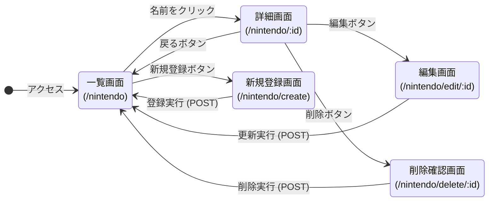

```mermaid
stateDiagram-v2
    direction LR
    %% 状態（画面）の定義
    state "一覧画面<br>(/nintendo)" as List
    state "詳細画面<br>(/nintendo/:id)" as Detail
    state "新規登録画面<br>(/nintendo/create)" as Create
    state "編集画面<br>(/nintendo/edit/:id)" as Edit
    state "削除確認画面<br>(/nintendo/delete/:id)" as Delete

    %% 遷移の定義
    [*] --> List: アクセス

    List --> Create: 新規登録ボタン
    Create --> List: 登録実行 (POST)

    List --> Detail: 名前をクリック
    Detail --> List: 戻るボタン

    Detail --> Edit: 編集ボタン
    Edit --> List: 更新実行 (POST)

    Detail --> Delete: 削除ボタン
    Delete --> List: 削除実行 (POST)
```